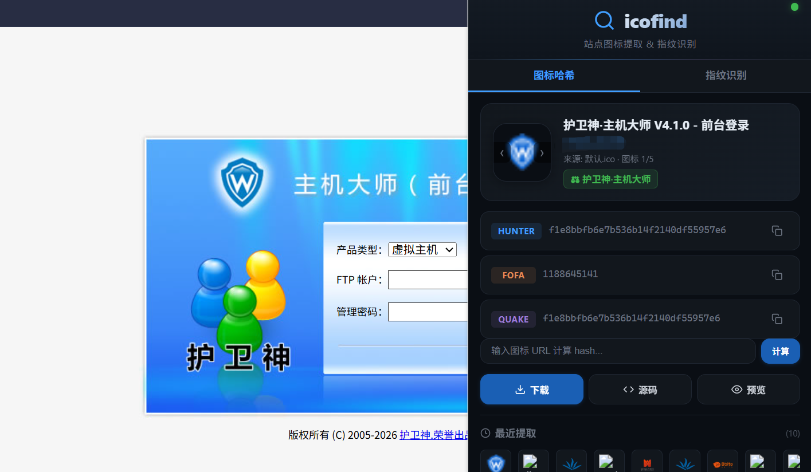
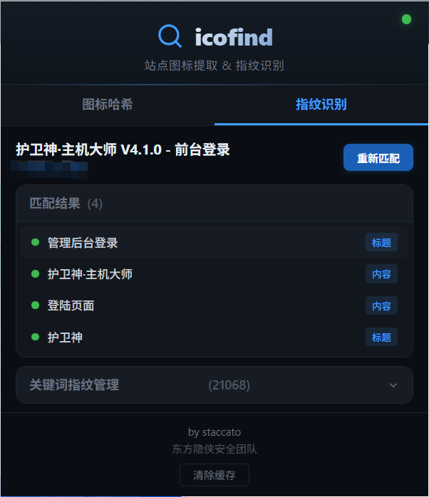

# icofind

Chrome 浏览器扩展，自动提取站点 favicon 图标计算哈希值，支持关键词指纹匹配，识别站点系统名称。

## 功能

### 图标哈希（标签页 1）

- **多途径图标提取**：link 标签、favicon.ico/png/svg、OG / Twitter 协议、Windows Tile、mask-icon
- **多格式兼容**：ICO / PNG / JPG / SVG / GIF / WebP
- **多图标并行计算**：提取前 5 个图标，并行 fetch 计算哈希，MD5 去重，可手动切换
- **三平台哈希**：Hunter（`web.icon="md5"`）、FOFA（`icon_hash`）、Quake（`favicon: "md5"`）
- **指纹库匹配**：哈希指纹库管理，支持增删导出导入，匹配到的系统名以绿色标签显示
- **智能缓存**：同页面再打开瞬间恢复，无需重新计算
- **图标操作**：下载、预览、查看源码、历史记录

### 指纹识别（标签页 2）

- **关键词匹配**：基于页面 HTML 源码和标题的关键词匹配识别
- **大容量指纹库**：支持导入 20,000+ 条关键词指纹规则
- **独立管理**：关键词指纹的增删导出导入，与哈希指纹分离管理
- **匹配规则**：body 需全部关键词命中，title 任一命中即可

### 公共特性

- **持久化存储**：`chrome.storage.local` 落盘存储，不受浏览器缓存清除影响
- **统一导入导出**：`{fingerprint: [...]}` 格式，导入时自动分拣哈希/关键词
- **去重**：导入和手动添加均按类型去重

## 安装

1. 打开 Chrome → `chrome://extensions/`
2. 开启「开发者模式」
3. 点击「加载已解压的扩展程序」→ 选择项目目录

## 使用指南

### 图标哈希

1. 打开任意网页，点击扩展图标，默认显示「图标哈希」标签页
2. 自动提取站点 favicon，显示图标和站点信息
3. 计算完成后显示三种哈希值，点击复制按钮复制对应搜索语法
4. 多图标时鼠标悬停图标区域出现 `‹` `›` 箭头可切换

### 指纹识别

1. 切换到「指纹识别」标签页
2. 展开「关键词指纹管理」，导入 或 `finger.json`

### 清除缓存

底部「清除缓存」按钮清除哈希缓存和页面状态，下次打开重新计算，指纹数据不受影响。

## 更新记录

### v1.2

- 新增「指纹识别」标签页
- 双标签页界面切换

### v1.1

- 界面全面美化
- 多图标支持：提取前 5 个图标，并行计算，命中指纹优先切换，同 hash 去重
- 图标手动切换：鼠标悬停显示 `‹` `›` 箭头，循环切换并更新显示
- 来源信息显示图标顺序（如「来源: link标签 · 图标 2/5」）
- 指纹库导入/导出，支持 JSON 备份恢复
- 可手动传入 favicon 链接进行计算
- 指纹库管理面板：可折叠，增删指纹
- 同页面重新打开完全走缓存，无需重新计算，瞬间恢复
- 手动清除缓存按钮
- 优化插件打开速度
- 异步哈希计算，不阻塞图标展示
- 图标提取支持多种格式（PNG/JPG/SVG/GIF/WebP / 默认路径多后缀）

### v1.0

- 初始版本，提取站点 favicon 计算 MD5 哈希
- 支持 link 标签、默认 favicon.ico、OG/Twitter 协议

---

by staccato / 东方隐侠安全团队
