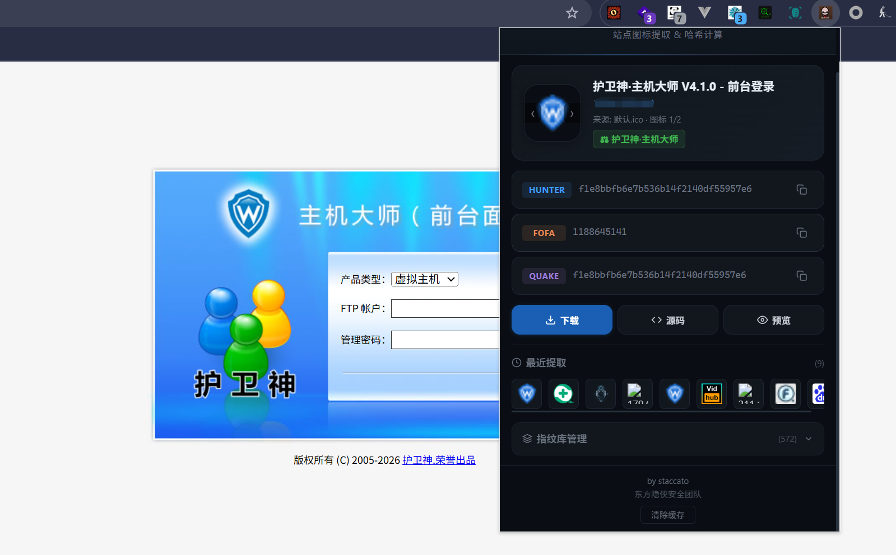

# icofind

Chrome 浏览器扩展，自动提取当前站点 favicon 图标并计算哈希值，支持指纹库匹配识别系统名称。

## 功能

- **多途径图标提取**：link 标签、favicon.ico/png/svg、OG / Twitter 协议、Windows Tile、mask-icon
- **多格式兼容**：ICO / PNG / JPG / SVG / GIF / WebP
- **多图标并行计算**：提取前 5 个图标，并行 fetch 计算哈希，自动去重，可手动切换
- **三平台哈希**：Hunter（`web.icon="md5"`）、FOFA（`icon_hash`）、Quake（`favicon: "md5"`）
- **指纹库匹配**：内置指纹库管理，支持增删导出导入，自动匹配系统名称
- **持久化存储**：`chrome.storage.local` 落盘存储，不受浏览器缓存清除影响
- **智能缓存**：同页面再打开瞬间恢复，无需重新计算
- **图标操作**：下载、预览、查看源码、历史记录

## 安装

1. 打开 Chrome → `chrome://extensions/`
2. 开启「开发者模式」
3. 点击「加载已解压的扩展程序」→ 选择项目目录

## 使用指南

### 基本使用

1. 打开任意网页，点击扩展图标
2. 插件自动提取站点 favicon，显示图标和站点信息
3. 计算完成后显示三种哈希值，点击右侧复制按钮即可复制对应搜索语法

### 多图标切换

如果站点存在多个图标（如 favicon.ico、favicon-32.png），鼠标悬停图标区域会出现左右箭头 `‹` `›`，点击可切换图标，同时更新对应的哈希值和来源信息。图标数量会在来源信息中显示（如「来源: link标签 · 图标 2/5」）。

### 指纹库管理

展开底部「指纹库管理」面板：

- **添加**：选择算法类型（Hunter MD5 / FOFA），输入 Hash 值和系统名称，点击添加
- **删除**：鼠标悬停条目，点击右侧 `×`
- **导出**：下载 `icofind_fingerprints.json` 备份文件
- **导入**：选择 JSON 文件合并导入（按 ID 去重，不覆盖已有条目）

匹配到的系统名称会以绿色标签显示在站点标题下方。

### 指纹库导入

项目包含从 [chainreactors/spray](https://github.com/chainreactors/spray) `fingers/ehole.json` 提取的 **572 条 FOFA 指纹**：

1. 展开底部「指纹库管理」
2. 点「导入」→ 选择 `icofind_fingerprints.json`

### 手动清除缓存

底部 footer 有「清除缓存」按钮，用于清除所有已缓存的哈希计算数据和页面状态，下次打开将重新计算。

## 截图

## 更新记录

### v1.2

- 界面全面美化
- 多图标支持：提取前 5 个图标，并行计算，命中指纹优先切换，同 hash 去重
- 图标手动切换：鼠标悬停显示 `‹` `›` 箭头，循环切换并更新显示
- 来源信息显示图标顺序（如「来源: link标签 · 图标 2/5」）
- 指纹库导入/导出，支持 JSON 备份恢复
- 指纹库管理面板：可折叠，增删指纹
- 同页面重新打开完全走缓存，无需重新计算，瞬间恢复
- 手动清除缓存按钮
- 优化插件打开速度
- 异步哈希计算，不阻塞图标展示
- 图标提取支持多种格式（PNG/JPG/SVG/GIF/WebP / 默认路径多后缀）

### v1.0
- 初始版本，提取站点 favicon 计算 MD5 哈希
- 支持 link 标签、默认 favicon.ico、OG/Twitter 协议

---

by staccato / 东方隐侠安全团队
